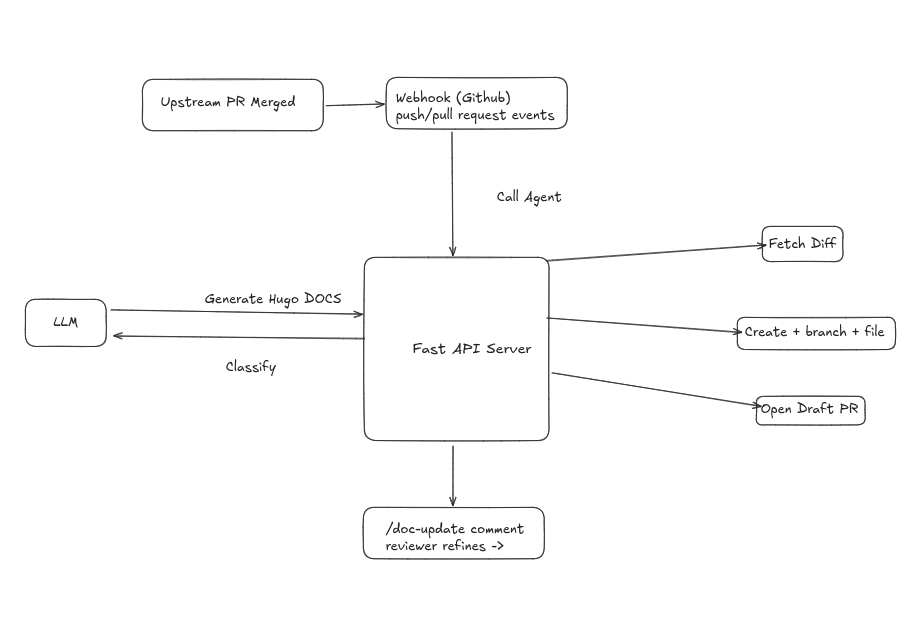

# Krkn Chaos — Automated Documentation Sync Bot (POC)

> **CNCF Mentorship POC**: *krkn-chaos: Automated Documentation Sync Bot (2026 Term 2)*

https://youtu.be/jcEfqS0iDxE

## Problem

The [krkn-chaos/website](https://github.com/krkn-chaos/website) repo hosts unified docs for the krkn ecosystem (Hugo/Docsy → [krkn-chaos.dev](https://krkn-chaos.dev)). When a dev changes code, docs are updated **manually** — tedious, easy to forget, error-prone.

## Solution

**GitHub App + FastAPI** that listens for PR events, classifies change types, generates Hugo markdown via Gemini, and opens a draft PR on the website repo — with interactive `/doc-update` refinement via PR comments.

## Architecture



## Workflow

1. PR merged on upstream repo → webhook received → diff fetched
2. Change classified (config, CLI, scenario, API, etc.)
3. Gemini generates Hugo/Docsy markdown
4. Draft PR created on website repo (`auto-docs/pr-{n}`)
5. Comment `/doc-update <instruction>` to refine interactively

## Classification

| Pattern | Type | Impact |
|---|---|---|
| `config.yaml`, `settings.json` | config_fields | Parameter tables |
| `scenarios/` | new_scenario | Scenario page |
| `cmd/`, `cli/`, `flag` | cli_flags | Flag reference |
| `README.md`, `docs/` | doc_update | Sync to website |
| `*.go` | code_change | May need doc review |
| `api/`, `proto/`, `openapi` | api_change | API reference update |

## Setup

```bash
uv sync
# Set env vars: GITHUB_APP_ID, WEBHOOK_SECRET, GEMINI_API_KEY, PA_TOKEN
uv run uvicorn main:app --reload --port 8080
# Expose: gh webhook forward --port=8080  or  smee -u https://smee.io/your-channel -P http://localhost:8080/webhook
```

## Key Decisions

- **GitHub App (not Actions)**: Cross-repo write access — one app serves all upstream repos
- **FastAPI (not serverless)**: Easier to debug/iterate during POC
- **Gemini**: Good at producing structured Hugo markdown; `/doc-update` enables human-in-the-loop

## POC Status

**Working**: Webhook events, diff fetching, change classification, branch/PR creation on fork, `/doc-update` refinement, HMAC verification

**Simplifications**: Hardcoded target file, cached AI agent (no API key needed to test), only `opened`/`synchronize` events, writes to a fork

**For Production**: Trigger on PR merge, dynamic file targeting, multi-repo support, smarter content merging, review comment handling, preview deploys

## Project Structure

```
POC/
├── main.py              # FastAPI server
├── github_tools.py      # GitHub API wrapper
├── config.py            # App config
├── test.py              # Test script
├── pyproject.toml       # Dependencies
├── .env                 # Secrets
├── krkn_pr_1261.diff    # Sample diff
├── agent.log / parsed_agent.log  # Cached AI output
└── POC.mp4              # Demo video
```

## License

Apache License 2.0 — part of the CNCF Mentorship program.
